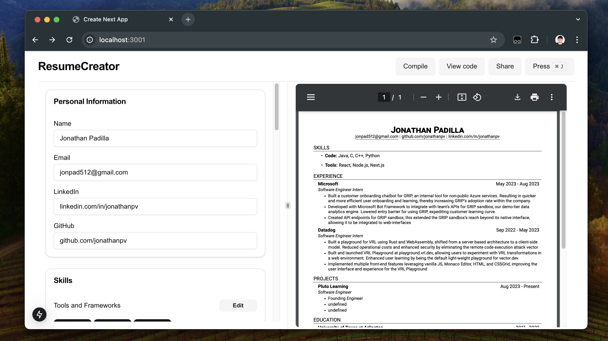
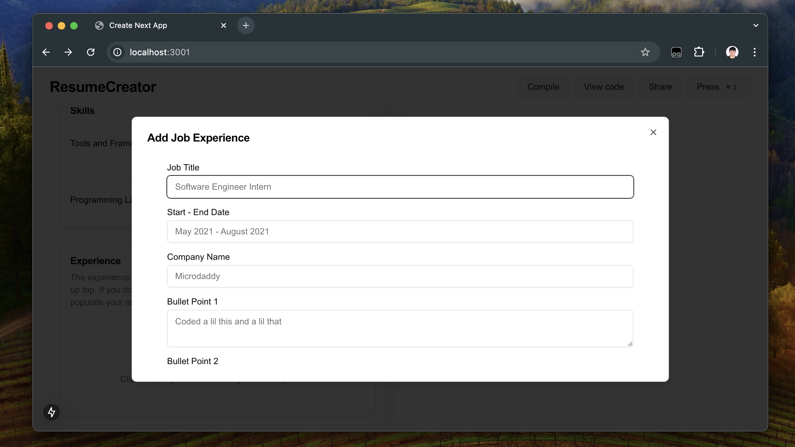
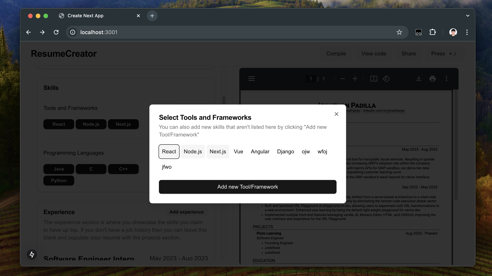
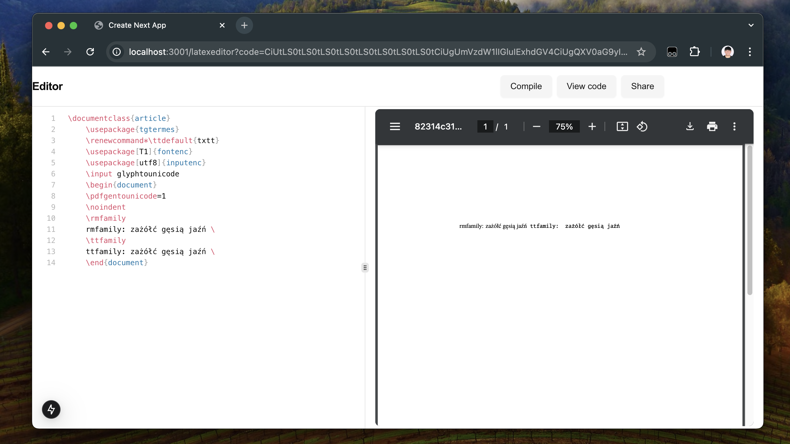

# ResumeBuilder


This is a resume builder using wasm based latex engine, works locally, however if you import packages it will require an internet connection.

## Demo
We can render full PDFs using a latex backed engine
|  |
| - |


## Adding experience
Most of the UI is Dialog based, adding all the information needed to build the resume as you go
|  |
| - |

## Adding skills
Adding skills is a matter of toggling the buttons in the UI
|  |
| - |

## Latex editor
This is a preview of the advanced usage, you can play around and write your own latex and compile it here, the actual app is based off of replacing strings with a template resume.
|  |
| - |


Helpful info on swift latex:
- [The read me here](https://github.com/gboyd068/obsidian-swiftlatex-render)
- [swift latex docs here](https://swiftlatex.com)

## Getting Started

First, run the development server:

```bash
npm run dev
# or
yarn dev
# or
pnpm dev
# or
bun dev
```

Open [http://localhost:3000](http://localhost:3000) with your browser to see the result.

You can start editing the page by modifying `app/page.tsx`. The page auto-updates as you edit the file.

This project uses [`next/font`](https://nextjs.org/docs/app/building-your-application/optimizing/fonts) to automatically optimize and load [Geist](https://vercel.com/font), a new font family for Vercel.

## Learn More

To learn more about Next.js, take a look at the following resources:

- [Next.js Documentation](https://nextjs.org/docs) - learn about Next.js features and API.
- [Learn Next.js](https://nextjs.org/learn) - an interactive Next.js tutorial.

You can check out [the Next.js GitHub repository](https://github.com/vercel/next.js) - your feedback and contributions are welcome!

## Deploy on Vercel

The easiest way to deploy your Next.js app is to use the [Vercel Platform](https://vercel.com/new?utm_medium=default-template&filter=next.js&utm_source=create-next-app&utm_campaign=create-next-app-readme) from the creators of Next.js.

Check out our [Next.js deployment documentation](https://nextjs.org/docs/app/building-your-application/deploying) for more details.
